```mermaid
flowchart LR
    A["Raw Competition Data"] --> B["EDA & Column Review"]
    B --> C["Fold Split"]
    C --> D["CTGAN per Fold"]
    D --> E["Preprocessing & Encoding"]
    E --> F["Under-sampling Ratio Test"]
    F --> G["Model Comparison"]
    G --> H["Voting / Stacking / Blending"]
    H --> I["Final Train & Inference"]
    I --> J["Submission ZIP"]
```

# FSI AIxData Challenge 2024


> 금융 이상거래 유형을 분류하기 위해 CTGAN 기반 소수 클래스 보강, Stratified K-Fold 검증, 언더샘플링, 트리 모델 앙상블을 실험한 금융 AI 경진대회 프로젝트입니다.

[대회 페이지](https://dacon.io/en/competitions/official/236297/overview/description) | [회고 글](https://pmq0328.tistory.com/2)

## 프로젝트 개요

| 항목 | 내용 |
| --- | --- |
| 대회 | FSI AIxData Challenge 2024 |
| 주제 | 이상 금융거래 탐지 AI 모델 고도화 |
| 문제 유형 | 13개 `Fraud_Type` 다중분류 |
| 평가 방식 | Macro F1 + TCAP |
| 최종 결과 | Public 28위 / Private 22위 |
| 회고 기준 결과 | 제출 로직 수정 시 Public 27위 / Private 20위 추정 |
| 핵심 접근 | CTGAN 증강, 5-fold 검증, 언더샘플링, XGBoost/LightGBM weighted blending |

## 문제 정의

이 프로젝트의 핵심은 단순히 분류 모델을 학습하는 것이 아니라, **불균형한 금융 이상거래 유형을 안정적으로 예측하는 검증 체계**를 만드는 것이었습니다. 다수 클래스가 전체 분포를 지배하고, 일부 이상거래 유형은 샘플 수가 부족했기 때문에 정확도 중심 접근으로는 실무적으로 의미 있는 모델을 만들기 어렵다고 판단했습니다.

중점 질문은 다음과 같았습니다.

- 소수 이상거래 유형을 보강하면서 검증 데이터 누수를 어떻게 막을 것인가?
- 어떤 언더샘플링 비율이 소수 클래스 재현율과 전체 안정성의 균형을 맞추는가?
- Public/Private 리더보드 변동에 덜 흔들리는 앙상블 전략은 무엇인가?

## 데이터와 공개 범위

대회 데이터는 DACON에서 제공한 합성 금융거래 데이터입니다. 다만 대회 데이터와 제출 산출물은 재배포 조건이 명확하지 않을 수 있어, 포트폴리오 관점에서는 **구조와 실험 흐름을 설명하는 문서**를 우선 평가 대상으로 봐야 합니다.

```text
data/
  train.csv
  test.csv
  sample_submission.csv
submissions/
  final_submission.zip
```

공개 안전성 기준:

- Drive에는 제출 ZIP, 실험별 제출 폴더, 원본 데이터, `.git` 백업이 섞여 있어 추가 업로드하지 않았습니다.
- 현재 저장소의 기존 데이터/제출 파일은 대회 산출물 확인용이며, 외부 제출 시에는 대회 약관에 맞춰 비공개 전환 또는 제외 검토가 필요합니다.
- 민감한 실제 금융 고객 정보는 포함하지 않았고, 대회 설명상 합성 데이터 기반입니다.

## 모델링 전략

### 1. 합성 데이터 생성

소수 클래스 보강을 위해 CTGAN을 사용했습니다. 검증 데이터 누수를 줄이기 위해 fold별 train split 안에서만 합성 데이터를 생성하는 방향을 실험했습니다.

### 2. 검증 설계

`StratifiedKFold`를 사용해 각 fold의 fraud type 분포를 최대한 유지했습니다. 단일 random split보다 불균형 데이터에서 로컬 검증 신뢰도가 높다고 판단했습니다.

### 3. 샘플링 전략

다수 클래스가 모델 판단을 지배하지 않도록 여러 언더샘플링 비율을 비교했습니다. 최종 방향은 소수 클래스 recall을 개선하면서 macro-level score가 무너지지 않는 비율을 찾는 것이었습니다.

### 4. 앙상블 전략

주요 모델군은 아래와 같습니다.

- XGBoost
- LightGBM
- CatBoost
- RandomForest baseline

Voting, stacking, blending을 비교했고, 최종 제출은 검증 성능이 안정적인 모델 중심의 weighted blending 전략을 사용했습니다.

## 파이프라인



## 결과

| 구분 | Public Rank | Private Rank | 비고 |
| --- | ---: | ---: | --- |
| 공식 제출 | 28 | 22 | 최종 제출 결과 |
| 회고 기준 수정 | 27 | 20 | 제출 로직 수정 후 추정 결과 |

가장 큰 배움은 성능이 분류기 하나로 결정되지 않는다는 점이었습니다. 검증 split, 합성 데이터 품질, sampling ratio, label mapping, 제출 패키징 로직이 모두 최종 점수에 영향을 줬습니다.

## 저장소 구성

```text
.
|-- README.md
|-- requirements.txt
|-- data/
|   |-- README.md
|   |-- train.csv
|   |-- test.csv
|   `-- sample_submission.csv
|-- docs/
|   |-- project-summary.md
|   |-- experiment-notes.md
|   `-- public-safety.md
|-- notebooks/
|   |-- eda_summary.ipynb
|   |-- ctgan_experiment.ipynb
|   |-- kfold_generation.ipynb
|   `-- final_modeling.ipynb
`-- submissions/
    `-- final_submission.zip
```

## 재현 방법

```bash
pip install -r requirements.txt
jupyter notebook notebooks/final_modeling.ipynb
```

필요 입력 파일:

```text
data/train.csv
data/test.csv
data/sample_submission.csv
```

최종 노트북은 분류 결과와 합성 데이터 제출 파일을 생성한 뒤 대회 요구 형식의 ZIP으로 패키징합니다.

## 회고

- **검증 설계 우선**: 단일 split 튜닝보다 fold 기반 검증 체계가 더 중요했습니다.
- **합성 데이터의 경계**: 소수 클래스 보강에는 도움이 됐지만, 생성 시점과 검증 누수 관리가 핵심이었습니다.
- **불균형 처리는 모델별로 다름**: sampling ratio, class weight, 모델군의 상호작용이 컸습니다.
- **제출 로직도 모델의 일부**: label mapping과 ZIP 패키징 오류가 최종 순위에 영향을 줄 수 있음을 배웠습니다.

## 참고 자료

- [DACON Competition Page](https://dacon.io/en/competitions/official/236297/overview/description)
- [Project Retrospective](https://pmq0328.tistory.com/2)
