# FSI AIxData Challenge 2024 - Anomalous Financial Transaction Detection

> CTGAN synthetic data, stratified validation, under-sampling, and weighted ensemble modeling for fraud-type classification.

[Competition Page](https://dacon.io/en/competitions/official/236297/overview/description) | [Project Retrospective](https://pmq0328.tistory.com/2)

## Project Overview

| Item | Description |
| --- | --- |
| Competition | FSI AIxData Challenge 2024 |
| Task | Improve AI models for anomalous financial transaction detection |
| Problem Type | Multi-class classification |
| Target | `Fraud_Type`, 13 classes |
| Evaluation | Macro F1 + TCAP |
| Final Result | Public 28th / Private 22nd |
| Retrospective Result | Potential Public 27th / Private 20th after fixing submission logic |
| Main Approach | CTGAN augmentation, 5-fold validation, under-sampling, XGBoost/LightGBM weighted blending |

## Problem Definition

The challenge provides synthetic financial transaction data and asks participants to classify each transaction into one of 13 fraud types. The central difficulty was not only model accuracy, but also **class imbalance**: the majority class dominated the training distribution while minority fraud types had limited examples.

This project focused on three practical modeling questions:

- How can minority fraud types be augmented without leaking validation information?
- Which sampling ratio improves minority-class recall without collapsing overall precision?
- Which ensemble strategy remains stable between local validation and public/private leaderboard evaluation?

## Data & Evaluation

The dataset was provided by DACON for the competition and is described as fully synthetic financial transaction data.

```text
data/
  train.csv
  test.csv
  sample_submission.csv
```

The final model was evaluated with a combined metric:

- **Macro F1**: measures balanced classification quality across all fraud types.
- **TCAP**: evaluates the quality of generated synthetic data for the competition's data generation task.

Because the leaderboard score depended on both classification and generated data quality, the workflow separated synthetic data generation, validation design, and final classification.

## Modeling Strategy

### 1. Synthetic Data Generation

CTGAN was used to generate additional samples for minority fraud classes. To avoid validation leakage, synthetic data was generated within each fold from the training split only.

### 2. Validation Design

`StratifiedKFold` was used to preserve the fraud-type distribution across folds. This made local validation more reliable than a single random split under severe class imbalance.

### 3. Sampling Strategy

Several under-sampling ratios were tested to reduce the majority-class dominance. The final direction favored a ratio that improved minority-class recall while keeping macro-level stability.

### 4. Ensemble Strategy

Tree-based models were the main modeling family:

- XGBoost
- LightGBM
- CatBoost
- RandomForest as a comparison baseline

Voting, stacking, and blending were tested. The final submission used a weighted blending strategy centered on the strongest validation models.

## Pipeline

```mermaid
flowchart LR
    A["Raw Competition Data"] --> B["EDA & Column Review"]
    B --> C["Fold Split"]
    C --> D["CTGAN per Fold"]
    D --> E["Preprocessing & Encoding"]
    E --> F["Under-sampling Ratio Test"]
    F --> G["Model Comparison"]
    G --> H["Voting / Stacking / Blending"]
    H --> I["Final Train & Inference"]
    I --> J["Submission ZIP"]
```



## Results

| Stage | Public Rank | Private Rank | Notes |
| --- | ---: | ---: | --- |
| Official Submission | 28 | 22 | Final submitted result |
| Retrospective Fix | 27 | 20 | Estimated result after correcting submission logic |

The most important lesson was that leaderboard performance was affected by the whole pipeline, not just the classifier. Validation split design, generated data quality, sampling ratio, and submission-file logic all changed the final outcome.

## Repository Structure

```text
.
├── README.md
├── requirements.txt
├── data/
│   ├── README.md
│   ├── train.csv
│   ├── test.csv
│   └── sample_submission.csv
├── docs/
│   ├── project-summary.md
│   └── experiment-notes.md
├── notebooks/
│   ├── eda_summary.ipynb
│   ├── ctgan_experiment.ipynb
│   ├── kfold_generation.ipynb
│   └── final_modeling.ipynb
└── submissions/
    └── final_submission.zip
```

## How to Reproduce

```bash
pip install -r requirements.txt
jupyter notebook notebooks/final_modeling.ipynb
```

Expected input files:

```text
data/train.csv
data/test.csv
data/sample_submission.csv
```

The final notebook creates classification and synthetic-data submission files, then packages them into the required ZIP format.

## Retrospective

- **Validation first**: a stable fold-based validation design was more useful than repeatedly tuning against a single split.
- **Synthetic data needs boundaries**: generated data helped minority-class modeling, but had to be created fold-by-fold to reduce leakage risk.
- **Imbalance handling is model-specific**: sampling ratio, class weights, and model family interacted strongly.
- **Submission logic matters**: the final score depended on packaging and label mapping as much as modeling.

## References

- [DACON Competition Page](https://dacon.io/en/competitions/official/236297/overview/description)
- [Project Retrospective](https://pmq0328.tistory.com/2)
