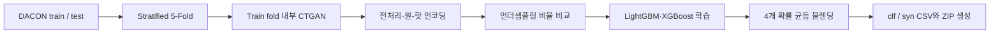

# FSI AIxData Challenge 2024


합성 금융거래 데이터에서 13개 `Fraud_Type`을 분류하고, 합성 데이터의 유용성과 익명성까지 함께 평가한 금융 AI 경진대회 프로젝트입니다. **120,000개 학습 행 중 118,800개가 단일 클래스 `m`에 집중된 극단적 불균형**을 CTGAN 증강, 언더샘플링, 트리 기반 앙상블로 다뤘습니다.

[공식 대회 안내](https://dacon.io/competitions/official/236297/overview/description) · [공식 규정](https://dacon.io/competitions/official/236297/overview/rules) · [공식 리더보드](https://dacon.io/competitions/official/236297/leaderboard) · [회고](https://pmq0328.tistory.com/2)

## 목차

- [프로젝트 개요](#프로젝트-개요)
- [문제 정의와 접근](#문제-정의와-접근)
- [핵심 구현](#핵심-구현)
- [결과와 배운 점](#결과와-배운-점)
- [내 기여](#내-기여)
- [실행 방법](#실행-방법)

## 프로젝트 개요

| 항목 | 내용 |
| --- | --- |
| 대회 | FSI AIxData Challenge 2024 |
| 기간 | 2024.08.05 ~ 2024.08.30 09:59 |
| 팀 | 간갠겐궨 (공식 리더보드 표기) |
| 과제 | 이상 금융거래의 `Fraud_Type` 다중 분류 및 합성 데이터 생성 |
| 분류 대상 | 13개 클래스 |
| 평가 | `0.7 × Macro F1 + 0.3 × (1 - TCAP)` |
| 공식 결과 | Private **0.702640** · **22위** |
| 최종 접근 | CTGAN 증강, Stratified 5-Fold, 언더샘플링 비율 9·10, 4개 모델 균등 블렌딩 |

## 문제 정의와 접근

학습 데이터는 120,000행, 테스트 데이터는 120,000행입니다. 학습 타깃에서 `m`은 118,800행이고 나머지 12개 클래스는 각 100행뿐이었습니다. 정확도만 올리면 다수 클래스 예측에 치우치므로, 이 프로젝트의 초점은 소수 클래스의 정보를 잃지 않으면서 리더보드의 분류·생성 데이터 평가를 함께 통과하는 것이었습니다.

1. 소수 클래스의 학습 신호를 늘리되 검증 데이터가 생성 과정에 섞이지 않게 하려면 어떻게 해야 하는가?
2. 다수 클래스를 어느 수준까지 줄여야 Macro F1의 균형을 유지할 수 있는가?
3. 단일 모델보다 서로 다른 샘플링 비율의 모델을 블렌딩하는 편이 더 안정적인가?


```mermaid
flowchart LR
    A["DACON train / test"] --> B["Stratified 5-Fold"]
    B --> C["Train fold 내부 CTGAN"]
    C --> D["전처리·원-핫 인코딩"]
    D --> E["언더샘플링 비율 비교"]
    E --> F["LightGBM·XGBoost 학습"]
    F --> G["4개 확률 균등 블렌딩"]
    G --> H["clf / syn CSV와 ZIP 생성"]
```

## 핵심 구현

### 1. 누수 없는 CTGAN 증강

`StratifiedKFold(n_splits=5, shuffle=True, random_state=736665)`로 분할한 뒤, 각 검증 fold의 학습 데이터만으로 클래스별 CTGAN을 학습했습니다. 클래스별로 최대 100개 행을 학습 표본으로 사용하고 1,000개 생성 행을 만들도록 구성했습니다. 즉, 검증 fold를 합성 데이터 학습에 사용하지 않도록 경계를 명시했습니다.

대회 제출용 생성 데이터는 클래스별 1,000행이 필요했습니다. CTGAN의 generator/discriminator loss 추이를 확인하고, epoch·생성 행 수·특성 구성을 바꿔가며 생성 데이터와 분류 성능의 균형을 탐색했습니다.

### 2. 입력 특성 정리

- 개인·계좌 식별자 5개는 모델 입력에서 제외했습니다.
- `Time_difference`는 초 단위 수치형 특성으로 변환했습니다.
- 거래 채널·운영체제 등 9개 범주형 컬럼은 학습 fold 기준 원-핫 인코딩했습니다.
- 날짜 문자열, IP·MAC 주소, 위치처럼 원본 구현에서 직접 학습에 쓰지 않은 고카디널리티 문자열 컬럼은 제외했습니다.

### 3. 불균형 제어와 블렌딩

다수 클래스는 전체 빈도가 가장 큰 라벨을 기준으로 자동 판단하고, 소수 클래스 합계에 대한 비율 9와 10으로 각각 언더샘플링합니다. 최종 확률은 아래 네 모델을 0.25씩 평균합니다.

| 학습 데이터 | 모델 |
| --- | --- |
| 언더샘플링 비율 9 | LightGBM, XGBoost |
| 언더샘플링 비율 10 | LightGBM, XGBoost |

### 4. 제출 형식까지 코드로 확인

노트북은 `clf_submission.csv`와 `syn_submission.csv`를 만들고, 두 파일만 포함한 ZIP을 저장소 루트의 `outputs/`에 생성합니다. ZIP을 만들기 전에 분류 제출물의 행·컬럼을 템플릿과 대조하고, 합성 제출물은 학습 데이터 컬럼 구성과 클래스별 1,000행·총 13,000행 조건을 확인합니다. 패키징 뒤에도 ZIP 내부 파일 목록을 다시 검사합니다.

## 결과와 배운 점

공식 Private 리더보드에서 **0.702640 · 22위**를 기록했습니다. 이 프로젝트에서 확인한 핵심은 분류기의 종류만 바꾸는 것보다 검증 분할, 생성 데이터의 범위, 다수 클래스 비율, 제출 파일 규격이 함께 맞물린다는 점입니다.

- CTGAN 증강은 반드시 학습 fold 내부에서 생성해야 검증 점수를 과대평가하지 않습니다.
- 언더샘플링은 비율 하나를 고정하기보다 후보 비율을 나란히 비교해야 합니다.
- 대회 점수는 Macro F1과 익명성 항 `1 - TCAP`를 함께 보므로, 분류 CSV와 합성 CSV를 별도 산출물로 관리해야 합니다.

### 검증 한계도 함께 확인

초기 8:2 holdout에서는 XGBoost가 0.9801, voting이 0.9809, stacking이 0.9818 수준의 내부 점수를 보였지만, 해당 제출 점수는 각각 0.6294, 0.6097, 0.6704였습니다. 이 차이를 근거로 단일 holdout 점수를 최종 근거로 삼지 않고, fold 단위 증강·검증과 실제 제출 결과를 함께 확인하는 방향으로 전환했습니다. 공개 노트북은 CTGAN 학습 비용 때문에 `RUN_FOLD_VALIDATION = False`를 기본값으로 두며, fold 점수가 필요할 때만 `True`로 바꿔 실행합니다.

### 5-Fold 검증 기록

당시 최종 구조와 같은 **언더샘플링 비율 9·10의 LightGBM·XGBoost 4모델 균등 블렌딩** 실행 기록에서 얻은 검증 Macro F1입니다. 이는 공개·Private 리더보드 점수가 아닌, 각 검증 fold의 내부 지표입니다.

| Fold | Macro F1 |
| --- | ---: |
| 1 | 0.496129 |
| 2 | 0.485404 |
| 3 | 0.547806 |
| 4 | 0.498087 |
| 5 | 0.538943 |
| 평균 | **0.513274** |

원본 데이터와 당시의 패키지 잠금 파일은 공개 저장소에 없으므로, 이 저장소는 **동일 점수의 재현을 보장하지 않습니다**. 원본 노트북은 Python 3.9.19 커널에서 실행됐으며, 이 공개본은 실제 사용한 모델링·제출 흐름을 처음부터 읽고 로컬 데이터로 다시 실행할 수 있도록 정리했습니다.

## 내 역할

생성 모델 파라미터 실험, 샘플링을 적용한 예측 모델 구축·실험, 최종 제출 산출물 구성을 담당했습니다.

- 64개 거래·고객·단말 특성의 의미를 분류하고, 식별자·상수성 컬럼·시간 문자열의 처리 기준을 수립했습니다.
- `Time_difference`를 초 단위로 변환하고, CTGAN 1,000 epoch·언더샘플링 비율 실험을 수행했습니다.
- 최종 9·10배 샘플링의 LightGBM·XGBoost 4모델 블렌딩과 `clf_submission.csv`·`syn_submission.csv` 패키징 절차를 구현했습니다.
- 탐색용 중간 산출물과 대회 원본 데이터는 공개 저장소에서 제외하고, 포트폴리오에서 검토 가능한 단일 실행 노트북으로 정리했습니다.

## 저장소 구성

```text
.
├── README.md
├── requirements.txt
├── data/
│   └── README.md              # 로컬에 둘 대회 입력 파일 계약
└── notebooks/
    └── final_modeling.ipynb   # 증강·검증·블렌딩·제출 생성 흐름
```

## 실행 방법

대회 페이지에서 받은 파일을 로컬 `data/` 폴더에 둡니다. 원본 CSV와 제출물은 재배포 조건 및 저장소 용량을 고려해 GitHub에 포함하지 않았습니다.

```text
data/
├── train.csv
├── test.csv
└── sample_submission.csv
```

```bash
python -m pip install -r requirements.txt
jupyter notebook notebooks/final_modeling.ipynb
```

노트북의 실행 결과는 Git에서 제외한 저장소 루트의 `outputs/`에 생성됩니다. CTGAN을 클래스별로 학습하므로, 실행 시간과 결과는 사용하는 하드웨어·패키지 버전에 따라 달라질 수 있습니다. Python·NumPy·PyTorch 난수 시드는 고정했지만, 패키지 잠금 파일과 원본 데이터가 없으므로 동일 점수 재현을 보장하지는 않습니다.

## 이용 안내

이 저장소는 포트폴리오·학습 기록 열람을 위해 공개합니다. 코드·문서·이미지의 재사용, 수정, 배포는 사전 문의가 필요합니다.
